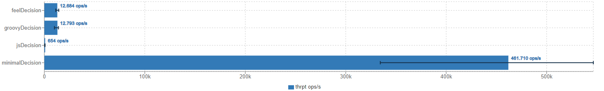

# Performance Test of Camunda DMN with JMH

This is a small test to evaluate the performance of Camundas DMN Implementation. It is meant together with a performance test of Drools - [JMH-DMN](https://github.com/DennisRippinger/jmh-drools). 

The test uses a rule set which does simple logic operations on the input. It uses different logic evaluation engines: FEEL, Groovy, JavaScript and a rule set with does just a plain comparison (minimalDecision).

To run execute:

```bash
$ mvn clean package && java -jar target/benchmarks.jar -rf json
```

The resulting file can be visualised with [JMH Visualizer](http://jmh.morethan.io)


